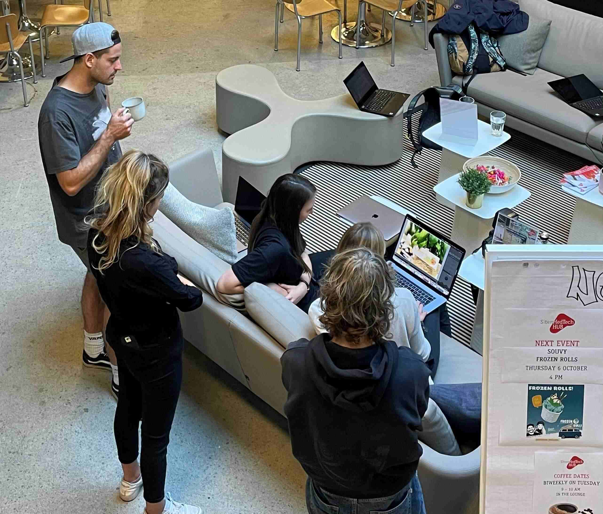

+++
title = "Ein Blick hinter die Kulissen von „souvy“"
date = "2022-12-02"
draft = false
pinned = false
image = "souvy-3.jpg"
+++
``

Moritz und Elias lernen während dem Fotoshooting für die neue website das start-up **„**souvy**“** von Angela Hulliger und Silas Bohren kennen. Nachhaltige Verpflegung am Arbeitsplatz aus einer anderen Perspektive.

``

Am Montagmorgen, 05.09.2022 machen wir uns gegen 08.30 Uhr auf, um bei einem Fotoshooting der Digitalagentur naa. für das start-up Unternehmen souvy dabei zu sein. Die Resultate des Fotoshootings werden anschließend für die neue Website von souvy verwendet. Wir sind sehr gespannt auf den bevorstehenden Morgen, denn Unternehmen wie souvy, die Lösungen zum Problem von Foodwaste und der Umweltverschmutzung gefunden haben, interessieren uns sehr

**Unterkapitel 1: Content creation mit der Digitalagentur naa.**

Wir treffen um 09:00 Uhr in den Geschäftsräumen von souvy, am Randweg 5a in Bern, ein. Die beiden Fotografinnen Fabienne und Julia von der jungen Digitalagentur naa. sind ebenfalls vor Ort. Sie wurden von Angela und Silas von souvy beauftragt, den neuen digitalen Auftritt zu gestalten. Nach einem ersten gegenseitigen Kennenlernen wird gemeinsam festgelegt, welche Art von Bildern für die Website gebraucht werden. Die Stimmung ist locker und entspannt und dennoch seriös und professionell. Für Angela und Silas ist es wichtig, dass ihr „intelligenter Kühlschrank“ gezeigt wird, dass man sieht, wie jemand den Kühlschrank bedient und wie ihre Menüs und Snacks aussehen. Die Vielfalt der Auswahl soll sichtbar werden. Die Bilder sollen simpel sein und nicht zu viel Verschiedenes zeigen.\
Um 09:30 Uhr beginnen die beiden Fotografinnen mit ihrer Arbeit. Wir können beobachten, wie sie konzentriert unterschiedlichste Sujets und Kamerawinkel ausprobieren. Sie sprechen sich untereinander ab, stellen Menüs um und komponieren mit viel Liebe zum Detail neue Einstellungen.\
Während die Fotografinnen weiterarbeiten, machen wir uns auf, zusammen mit Angela und Silas hinter die Kulissen von souvy zu schauen.

